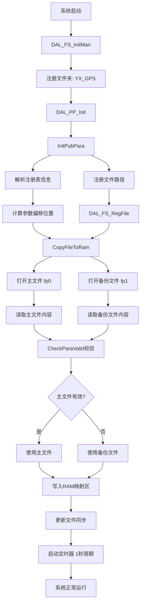

# PP参数详解 - 行驶记录仪项目

> [!abstract] 📋 文档概述
> **PP (Public Parameters)** 是行驶记录仪项目中用于持久化存储系统配置参数的核心机制。本文档详细介绍PP参数的分类、存储结构、加载流程及API接口。

---

## 📑 目录

- [[#PP参数概述]]
- [[#PP参数分类]]
- [[#PP参数存储结构]]
- [[#PP参数加载配置过程]]
- [[#主要PP参数列表]]
- [[#PP参数API接口]]
- [[#PP参数存储路径]]
- [[#参数数据完整性保障]]

---

## PP参数概述

**PP** 是 **Public Parameters（公共参数）** 的缩写，是本行驶记录仪项目中用于持久化存储系统配置参数的机制。PP参数系统提供了一种可靠的方式来存储、读取和管理设备运行过程中需要保存的各种配置信息。

### ✨ 主要特点

| 特性 | 说明 |
|:-----|:-----|
| **持久化存储** | 参数存储在Flash文件系统中，断电后不会丢失 |
| **备份机制** | 每个参数都有主文件和备份文件，确保数据安全 |
| **校验机制** | 使用校验和验证参数有效性 |
| **延时存储** | 支持延时写入，减少Flash写入次数 |
| **变化通知** | 支持参数变化回调通知机制 |

---

## PP参数分类

PP参数按照重要性和存储特性分为 **4大类**：

### 1️⃣ PP_TYPE_CRITICAL (关键参数) - `ppcri.pb`

> [!important] 关键参数
> 存储设备运行最关键的参数，需要**快速保存**（延时2秒）。

| 参数ID | 参数名称 | 结构体类型 | 备份属性 | 说明 |
|:-------|:---------|:-----------|:---------|:-----|
| `EGCODE_` | 区域号 | EGCODE_T | PP_BK | 区域编码 |
| `IMSI_` | IMSI号 | IMSI_T | PP_NBK | SIM卡IMSI |
| `SMSTEL_` | 短信中心号 | SMSTEL_T | PP_NBK | 短信服务中心号码 |
| `ONLINEMODE_` | 在线模式 | ONLINEMODE_T | PP_NBK | UDP/TCP在线模式 |
| `PP_NETMODE` | 网络模式 | PP_NETMODE_T | PP_NBK | 当前网络模式 |
| `USERINFO_` | GPRS用户信息 | USERINFO_T | PP_BK | GPRS用户名密码 |
| `OILCONTROL_` | 油路控制 | OILCONTROL_T | PP_NBK | 油路电路控制状态 |
| `ALARMCONFIG_` | 报警配置 | ALARM_CONFIG_T | PP_BK | 报警屏蔽/短信/拍照配置 |
| `VEHICLEINF_` | 车辆信息 | VEHICLEINF_T | PP_BK | 车牌号、VIN码等 |
| `DEVICEINFO_` | 设备信息 | DEVICEINFO_T | PP_NBK | 注册信息 |
| `GPRSIP_` | GPRS IP配置 | GPRSIP_T | PP_BK | 服务器IP/端口/APN |
| `DRIVERINFO_` | 驾驶员信息 | DRIVER_INFO_T | PP_NBK | 本地司机信息 |
| `TIREDRUN_` | 疲劳驾驶参数 | TIREDRUNPARA_T | PP_NBK | 疲劳驾驶时间门限 |

---

### 2️⃣ PP_TYPE_COMMON (普通参数) - `ppcom.pb`

> [!note] 普通参数
> 存储一般配置参数，**延时2秒**保存。

| 参数ID | 参数名称 | 结构体类型 | 说明 |
|:-------|:---------|:-----------|:-----|
| `LINKPARASET_` | 链路参数 | LINK_PARA_T | 心跳间隔、超时时间等 |
| `AUTOMONPARA_` | 自动上报参数 | AUTOMONITORPARA_T | 定时位置上报配置 |
| `SLEEPREPTPARA_` | 休眠汇报参数 | MONITOR_PARA_T | 休眠期间位置上报 |
| `SPEEDALMPARA_` | 超速报警参数 | SPEEDALMPARA_T | 超速门限和时间 |
| `GPSEXPARA_` | GPS扩展参数 | GPSEXPARA_T | GPS定位模式和滤波 |
| `CENTERTEL_` | 中心平台电话 | TEL_T | 监控中心电话号码 |
| `CANPARA_` | CAN参数 | CANPARA_T | CAN波特率、采集间隔 |
| `VIDEOPARA_` | 视频参数 | VIDEO_PARA_SET_T | 视频编码、分辨率、码率 |
| `SLEEPPARA_` | 省电参数 | SLEEP_PARA_T | 省电模式和延时 |
| `GNSSPARA_` | GNSS参数 | GNSSPARA_T | GNSS定位系统配置 |

---

### 3️⃣ PP_TYPE_DELAY (延时参数) - `ppdly.pb`

> [!tip] 延时参数
> 存储需要**延时保存**的参数（延时600秒），主要用于状态数据。

| 参数ID | 参数名称 | 结构体类型 | 说明 |
|:-------|:---------|:-----------|:-----|
| `ODOMETER_` | 里程统计 | ODOMETER_T | 累计里程 |
| `SYSTIME_` | 系统时间 | SYSTIME_T | 系统时间状态 |
| `OLDGPSPOS_` | 上次有效位置 | OLDGPSPOS_T | 上次GPS有效位置 |
| `NVRAM_ID_MONITOR1~8` | 监控数据 | MONITOR_T | 监控状态缓存 |
| `ND_TIREDCOUNT_` | 疲劳驾驶统计 | ND_TIREDCOUNT_T | 疲劳驾驶时长统计 |

---

### 4️⃣ PP_TYPE_NVFLASH (非易失参数) - `ppnvf.pb`

> [!warning] 非易失参数
> 存储不应被删除的关键参数（如**恢复出厂设置时保留**）。

| 参数ID | 参数名称 | 结构体类型 | 说明 |
|:-------|:---------|:-----------|:-----|
| `TR_ID_` | 行驶记录仪ID | TR_ID_T | 生产认证代码 |
| `MYTEL_~MYTEL4_` | 本机电话 | TEL_T | 设备电话号码 |
| `GPRSIP_~GPRSIP4_` | GPRS配置 | GPRSIP_T | 多IP服务器配置 |
| `VEHICLEINF_` | 车辆信息 | VEHICLEINF_T | 车辆特征系数 |
| `DEVICEINFO_` | 设备信息 | DEVICEINFO_T | 终端注册信息 |

---

## PP参数存储结构

### 📁 文件结构

每个PP参数在文件中按以下格式存储：

```
+------------------+------------------+------------------+
|  校验和(2字节)   |  参数数据(N字节) |  边界标志(1字节) |
+------------------+------------------+------------------+
|    PP_HEAD_T     |    参数内容      |    BOUND_FLAG    |
+------------------+------------------+------------------+
```

### 💾 内存映射结构

```c
typedef struct {
    INT8U chksum[2];   // 校验和，用于验证参数有效性
} PP_HEAD_T;

typedef struct {
    INT8U   valid;             // 参数有效标志: 'V'表示有效
    INT8U   attrib;            // 操作属性
    INT16U  space;             // 记录占用空间
    INT32U  offset;            // 参数在文件中的偏移位置
    PP_REG_T const *preg;      // 注册信息指针
} PP_T;
```

### 📝 参数注册信息结构

```c
typedef struct {
    INT8U        type;           // 参数类型（所属类）
    INT8U        id;             // 参数统一编号
    INT16U       rec_size;       // 参数长度
    INT8U        bk;             // 备份属性: PP_BK(需备份), PP_NBK(不需备份)
    void const  *i_ptr;          // 默认参数指针
} PP_REG_T;
```

---

## PP参数加载配置过程

### 🔄 初始化流程图



### 📖 详细加载步骤

#### 1. 文件系统初始化

> [!example] `DAL_FS_InitMan` - dal_fs_man.c: 第884-903行

```c
void DAL_FS_InitMan(void)
{
    // 初始化文件管理模块
    DAL_FS_ApplyHdisk();  // 申请硬盘电源
    
    // 注册参数文件夹，路径为: /mnt/hostdisk/YX_GPS/
    g_folderno_para = DAL_FS_RegDir(SHELL_DIR_TYPE_HOST_DATA0, 
                                     "YX_GPS", 
                                     true, 
                                     MAX_PARA_DIR_SIZE);
}
```

#### 2. PP参数初始化

> [!example] `DAL_PP_Init` - dal_pp_drv.c: 第632-650行

```c
void DAL_PP_Init(void)
{
    YX_MEMSET(&s_dcb, 0, sizeof(s_dcb));  // 清空控制块
    
    s_dcb.lock = PP_LOCK;                 // 锁定初始化过程
    InitPubPara();                        // 初始化公共参数
    s_dcb.lock = 0;                       // 解锁
    
    // 启动定时更新定时器
    s_updatetmr = YX_InstallTmr(PRIO_COMMONTASK, 0, UpdateTmrProc);
    YX_StartTmr(s_updatetmr, PERIOD_UPDATE);
    
    // 注册复位回调，确保复位前保存参数
    OS_RegResetHooker(RESET_HDL_PRIO_LOW, ResetInform_PP);
}
```

#### 3. 参数校验

> [!example] `CheckParaValid` - dal_pp_drv.c: 第101-115行

```c
static BOOLEAN CheckParaValid(INT8U *ptr, INT16U len)
{
    PP_HEAD_T *phead;
    HWORD_UNION chksum;
    
    phead = (PP_HEAD_T *)ptr;
    chksum.bytes.high = phead->chksum[0];
    chksum.bytes.low  = phead->chksum[1];
    
    // 计算校验和并比较
    if (YX_u_chksum_2(ptr + sizeof(PP_HEAD_T), 
                      len - sizeof(PP_HEAD_T) - 1) != chksum.hword) {
        return FALSE;
    }
    return TRUE;
}
```

---

## 主要PP参数列表

### 🌐 网络通讯参数

| 参数 | 结构体定义 | 默认值 | 说明 |
|:-----|:-----------|:-------|:-----|
| `GPRSIP_` | GPRSIP_T | APN:cmnet, 用户:card, IP:jt1.gghypt.net:7008 | 主服务器配置 |
| `USERINFO_` | USERINFO_T | 用户名:card, 密码:card | GPRS认证信息 |
| `LINKPARASET_` | LINK_PARA_T | 心跳:60秒, TCP超时:5秒, 重传:3次 | 链路通讯参数 |
| `ONLINEMODE_` | ONLINEMODE_T | TCP模式(0x01) | UDP/TCP选择 |

### 📍 GPS定位参数

| 参数 | 结构体定义 | 默认值 | 说明 |
|:-----|:-----------|:-------|:-----|
| `GPSEXPARA_` | GPSEXPARA_T | 滤波关闭, 北斗定位(0x02) | GPS模式和滤波 |
| `GNSSPARA_` | GNSSPARA_T | GPS定位(0x01), 波特率9600 | GNSS采集和上传配置 |
| `ODOMETER_` | ODOMETER_T | 无默认值 | 累计里程统计 |

### 🚨 报警参数

| 参数 | 结构体定义 | 默认值 | 说明 |
|:-----|:-----------|:-------|:-----|
| `ALARMCONFIG_` | ALARM_CONFIG_T | 报警屏蔽:0x00000000 | 报警行为配置 |
| `SPEEDALMPARA_` | SPEEDALMPARA_T | 门限:100km/h, 持续:5秒 | 超速报警参数 |
| `TIREDRUN_` | TIREDRUNPARA_T | 驾驶:14400秒, 休息:1200秒 | 疲劳驾驶门限 |
| `HITCONFIG_` | HITCONFIG_T | 碰撞门限70, 侧翻45° | 碰撞侧翻配置 |

### 📹 视频参数

| 参数 | 结构体定义 | 默认值 | 说明 |
|:-----|:-----------|:-------|:-----|
| `PP_ID_VIDEOPARA` | VIDEO_PARA_SET_T | 实时流:352x288, 15fps, 存储:1280x720, 25fps | 视频编码配置 |
| `PP_ID_VIDEOEVENT` | VIDEO_EVENT_PARA_T | 报警录像300秒, 定时录像600秒 | 事件录像时长 |
| `PP_ID_VIDEOWAKEUP` | VIDEO_WAKEUP_PARA_T | 报警唤醒+实时唤醒 | 休眠唤醒配置 |

### 🚗 车辆参数

| 参数 | 结构体定义 | 默认值 | 说明 |
|:-----|:-----------|:-------|:-----|
| `VEHICLEINF_` | VEHICLEINF_T | 车牌分类空, 安装时间BCD | 车辆识别信息 |
| `FACTORSET_` | FACTORSET_T | 无默认值 | 脉冲系数设置 |
| `DEVICEINFO_` | DEVICEINFO_T | 制造商ID:35020070118 | 终端注册信息 |

---

## PP参数API接口

### 🔍 读取参数

```c
// 读取参数并判断有效性，无效时返回默认值
BOOLEAN DAL_PP_ReadParaByID(INT8U id, INT8U *dptr, INT16U rlen);
```

> [!example] 使用示例

```c
LINK_PARA_T linkpara;
if (DAL_PP_ReadParaByID(LINKPARASET_, (INT8U *)&linkpara, sizeof(linkpara))) {
    // 参数有效，使用读取的值
    heartbeat = linkpara.heartbeat;
} else {
    // 参数无效，使用默认值
    heartbeat = DEF_HEART_PERIOD;
}
```

---

### 💾 存储参数

```c
// 延时存储参数（2秒后写入Flash）
BOOLEAN DAL_PP_StoreParaByID(INT8U id, INT8U *sptr, INT16U slen);

// 立即存储参数到Flash
BOOLEAN DAL_PP_StoreParaInstantByID(INT8U id, INT8U *sptr, INT16U slen);
```

> [!example] 使用示例

```c
LINK_PARA_T linkpara;
linkpara.heartbeat = 30;
linkpara.tcp_ot = 10;
DAL_PP_StoreParaByID(LINKPARASET_, (INT8U *)&linkpara, sizeof(linkpara));
```

---

### 📋 其他API接口

| API函数 | 功能说明 |
|:--------|:---------|
| `DAL_PP_CheckParaValidByID(id)` | 检查参数有效性 |
| `DAL_PP_ClearParaByID(id)` | 清除指定参数 |
| `DAL_PP_DelParaByClass(cls)` | 删除指定类的所有参数 |
| `DAL_PP_DelAllPara()` | 删除所有参数（恢复出厂设置） |
| `DAL_PP_RegParaChangeInformer(id, fp)` | 注册参数变化回调函数 |

---

## PP参数存储路径

### 📂 完整存储路径

PP参数文件存储在主机数据分区下：

```
/mnt/hostdisk/YX_GPS/
    ├── ppcri.pb      # 关键参数主文件
    ├── ppcri.pb.1    # 关键参数备份文件
    ├── ppcom.pb      # 普通参数主文件  
    ├── ppcom.pb.1    # 普通参数备份文件
    ├── ppdly.pb      # 延时参数主文件
    ├── ppdly.pb.1    # 延时参数备份文件
    ├── ppnvf.pb      # 非易失参数主文件
    └── ppnvf.pb.1    # 非易失参数备份文件
```

### 🗂️ 目录类型映射

| 目录类型宏 | 实际路径 | 说明 |
|:-----------|:---------|:-----|
| `SHELL_DIR_TYPE_HOST_DATA0` | /mnt/hostdisk/ | 主机数据分区 |
| `SHELL_DIR_TYPE_HDISK_DATA0` | /mnt/hdisk/ | 硬盘数据分区 |
| `SHELL_DIR_TYPE_SDISK_DATA0` | /mnt/sdcard/ | SD卡数据分区 |
| `SHELL_DIR_TYPE_PM_PART2` | /mnt/backupdisk/ | 防护存储器 |

---

## 参数数据完整性保障

### 🔄 双文件备份机制

> [!info] 备份策略
> 每个PP参数类都有两个文件：
> - **主文件** (xxx.pb): 正常读写的主数据文件
> - **备份文件** (xxx.pb.1): 数据备份文件
> 
> 当系统检测到主文件参数无效时，会自动从备份文件恢复数据。

### ✅ 校验和验证

每个参数存储时计算并保存校验和：

```c
chksum.hword = YX_u_chksum_2(data_ptr, data_len);
phead->chksum[0] = chksum.bytes.high;
phead->chksum[1] = chksum.bytes.low;
```

读取时验证校验和确保数据未被破坏。

### ⚡ 复位前保存

系统注册了复位回调函数：

```c
OS_RegResetHooker(RESET_HDL_PRIO_LOW, ResetInform_PP);
```

在系统复位前会强制将所有RAM中的参数写入Flash文件。

---

## 📊 总结

> [!summary] 核心要点
> PP参数系统是本行驶记录仪项目的**核心配置管理模块**，通过：
> - 合理的分类（关键/普通/延时/非易失）
> - 可靠的存储机制（双文件备份+校验和）
> - 完善的API接口
> 
> 确保了设备配置参数的**安全性和可靠性**。理解PP参数的加载过程和使用方法，对于开发和维护该项目至关重要。

---

> [!tip] 🔗 相关文档
> - [[docs/Terminal_Communication_Flow.md|终端通信流程详解]]
> - [[#PP参数分类|参数分类详解]]