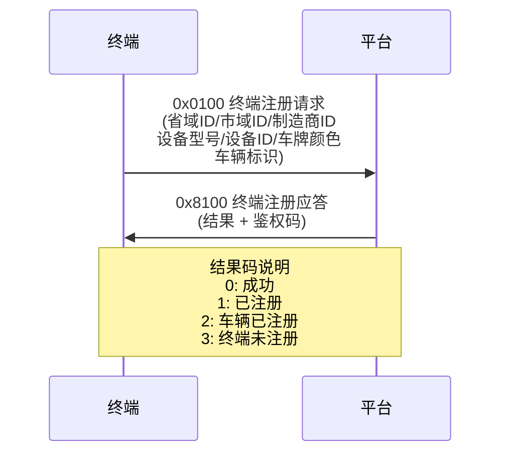
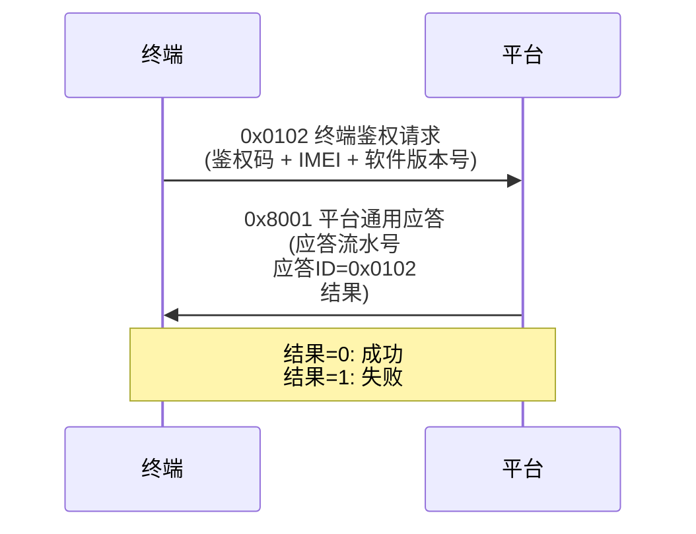
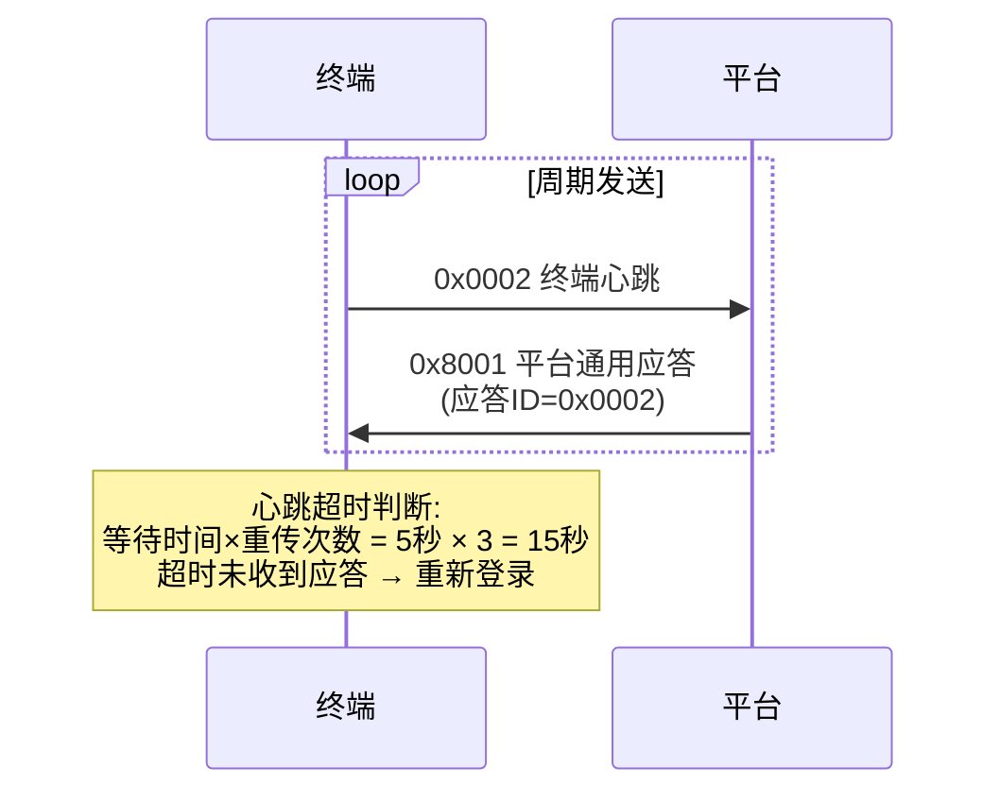
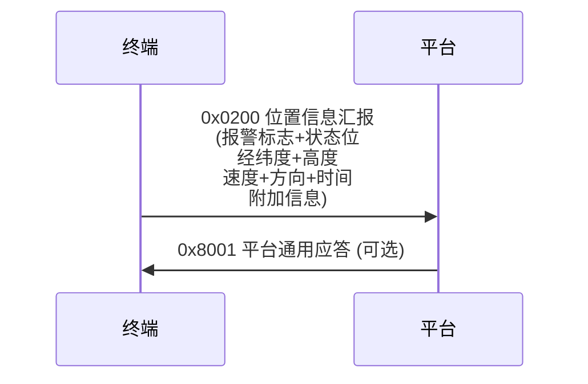
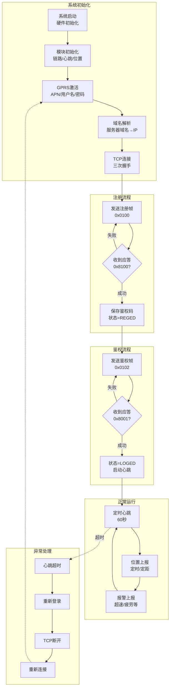

# 行驶记录仪终端通信流程详解

> [!abstract] 📋 文档概述
> 本文档详细介绍基于 **JT/T 808协议** 的行驶记录仪终端通信流程，涵盖系统初始化、终端注册、鉴权登录、心跳保活、位置上报等核心流程。

---

## 📑 目录

- [[#概述]]
- [[#系统初始化]]
- [[#终端注册流程]]
- [[#终端鉴权流程]]
- [[#心跳机制]]
- [[#位置信息上报]]
- [[#完整流程图]]
- [[#关键协议说明]]

---

## 概述

本项目是基于 **JT/T 808协议**（交通部卫星定位系统终端通讯协议）的行驶记录仪系统。

### 🔄 通信流程概览

```
设备开机 → 系统初始化 → GPRS激活 → TCP连接 → 终端注册 → 终端鉴权(登录) → 心跳保活 → 位置数据上报
```

### 🧩 核心模块划分

| 模块 | 文件位置 | 主要功能 |
|:-----|:---------|:---------|
| **链路管理** | `yx_jt1_tlink.c` | TCP连接、注册、登录状态管理 |
| **数据发送** | `yx_jt1_tsend.c` | 注册帧、登录帧、心跳帧组帧发送 |
| **数据接收** | `yx_jt1_trecv.c` | TCP数据接收、协议帧解析 |
| **消息处理** | `yx_generalman.c` | 平台应答消息处理 |
| **心跳管理** | `yx_hearttable.c` | 心跳定时器、超时重传 |
| **位置上报** | `yx_posrept.c` | 位置信息组帧和上报 |
| **协议帧组帧** | `yx_sysframe.c` | 808协议帧头组帧 |

---

## 系统初始化

### 1️⃣ 整体初始化流程

系统启动时，各模块按优先级依次初始化：

> [!example] 主初始化流程（简化版）

```c
void System_Init(void)
{
    // 1. 硬件初始化
    PORT_InitHardware();          // GPIO、UART、SPI等
    
    // 2. 文件系统初始化  
    DAL_FS_InitMan();             // 注册参数文件夹
    DAL_PP_Init();                // PP参数加载
    
    // 3. 通信模块初始化
    DAL_GSM_Init();               // GSM模块初始化
    DAL_GPRS_Init();              // GPRS驱动初始化
    DAL_TCP_Init();               // TCP驱动初始化
    
    // 4. 协议层初始化
    YX_InitSysframe();            // 系统帧模块初始化
    YX_InitHeartTable();          // 心跳表初始化
    YX_JT_InitLinkMan();          // 链路管理初始化
    
    // 5. 应用层初始化
    YX_PosRept_Init();            // 位置上报模块初始化
}
```

### 2️⃣ 链路管理初始化

> [!example] `YX_JTT1_InitLink` - yx_jt1_tlink.c

```c
void YX_JTT1_InitLink(void)
{
    // 清空链路控制块
    YX_MEMSET(&s_lcb, 0, sizeof(s_lcb));
    s_lcb.gprsid = 0xff;          // GPRS应用ID初始值
    s_lcb.ipflag = FALSE;         // IP地址未获取
    
    // 安装定时器
    s_monitortmr = YX_InstallTmr(PRIO_OPTTASK, 0, MonitorTmrProc);  // 监控定时器
    s_delaytmr = YX_InstallTmr(PRIO_OPTTASK, 0, DelayTmrProc);      // 延时定时器
    
    // 安装心跳
    s_lcb.heartid = YX_InstallHeart(
        YX_JTT1_LinkIsLoged,      // 检查是否已登录
        TcpHeartSend,             // 心跳发送函数
        YX_JTT1_InfromLinkOut     // 心跳超时通知
    );
    
    // 注册参数变化回调
    YX_RegParaChangeInformer(LINKPARASET_, InformLinkParaChange);  // 链路参数
    YX_RegParaChangeInformer(DEVICEINFO_, InformDeviceInfoChange); // 设备信息
    
    // 加载心跳参数
    InformLinkParaChange(0);
}
```

### 3️⃣ 链路状态定义

链路控制块(LCB)中的状态标志：

```c
#define ACTIVE_     0x80    // 已激活应用
#define CONNECT_    0x01    // TCP连接成功
#define REGED_      0x02    // 已注册
#define LOGED_      0x04    // 已登录
#define RECONNECT_  0x08    // 需要重新连接
```

| 状态 | 判断条件 |
|:-----|:---------|
| 已激活 | `(status & ACTIVE_) != 0` |
| 已连接 | `(status & (ACTIVE_\|CONNECT_)) == (ACTIVE_\|CONNECT_)` |
| 已注册 | `(status & (ACTIVE_\|CONNECT_\|REGED_)) == (ACTIVE_\|CONNECT_\|REGED_)` |
| 已登录 | `(status & (ACTIVE_\|CONNECT_\|REGED_\|LOGED_)) == (ACTIVE_\|CONNECT_\|REGED_\|LOGED_)` |

---

## 终端注册流程

### 📋 注册流程概述



### 🔧 注册帧组帧详解

> [!info] 协议ID
> **`UP_CMD_REG (0x0100)`**

> [!example] `YX_AsmRegFrame_Ex` - yx_sysframe.c

```c
INT16U YX_AsmRegFrame_Ex(INT8U *dptr, INT16U dmaxlen, TEL_T *dtel, INT8U jtype)
{
    DEVICEINFO_T devinfo;      // 设备注册信息
    VEHICLEINF_T vehicleinfo;  // 车辆信息
    
    // 从PP参数读取设备信息
    YX_ReadPubParaByID(DEVICEINFO_, &devinfo, sizeof(devinfo));
    YX_ReadPubParaByID(VEHICLEINF_, &vehicleinfo, sizeof(vehicleinfo));
    
    // 组帧协议头
    YX_ASMSYSFrameHead_MODE_Ex(jtype, &wstrm, UP_CMD_REG, pkgatr, 0);
    
    // 写入省域ID (2字节)
    temp = (devinfo.province[0] << 8) + devinfo.province[1];
    YX_WriteHWORD_Strm_APP(&wstrm, temp);
    
    // 写入市域ID (2字节)
    temp = (devinfo.city[0] << 8) + devinfo.city[1];
    YX_WriteHWORD_Strm_APP(&wstrm, temp);
    
    // 写入制造商ID (11字节 - 2019协议)
    YX_WriteDATA_Strm(&wstrm, devinfo.manufacturerid, sizeof(devinfo.manufacturerid));
    
    // 写入设备型号 (30字节 - 2019协议)
    YX_WriteDATA_Strm(&wstrm, dtype, sizeof(dtype));
    
    // 写入设备ID (30字节 - 2019协议)
    YX_WriteDATA_Strm(&wstrm, devinfo.devid, sizeof(devinfo.devid));
    
    // 写入车牌颜色 (1字节)
    YX_WriteBYTE_Strm(&wstrm, devinfo.colour);
    
    // 写入车辆标识 (VIN码或车牌)
    if (devinfo.colour != 0) {
        YX_WriteSTR_Strm(&wstrm, (char *)devinfo.vehistring);
    } else {
        YX_WriteDATA_Strm(&wstrm, vehicleinfo.vin, vehicleinfo.l_vin);
    }
    
    // 写入校验码
    YX_WriteBYTE_Strm(&wstrm, YX_ChkSum_Xor(...));
    
    return YX_GetStrmLen(&wstrm);
}
```

### 📤 注册请求发送

```c
// yx_jt1_tlink.c: Turninto_Reging()
static void Turninto_Reging(void)
{
    // 检查是否已注册（有鉴权码）
    if (YX_CheckRegCode_FIRST()) {
        Turninto_REGED();       // 已注册，直接进入注册成功状态
        return;
    }
    
    // 组帧注册请求
    tmplen = YX_JTT1_AsmRegFrame(tmpptr, BUFFER_LEN, &attrib, &dtel);
    
    // 通过TCP发送
    if (++s_lcb.ct_reg <= MAX_REG) {    // 最大注册次数=3
        DAL_TCP_ClearBuf(COM_TCP);
        YX_JTT1_SendFromGPRS(attrib, 0x10, TCPLOG_PTOTOCOL_TYPE, tmpptr, tmplen);
    }
    
    // 启动注册应答等待定时器
    YX_StartTmr(s_monitortmr, PERIOD_REG);  // 30秒超时
}
```

### 📥 注册应答处理

```c
// yx_generalman.c: HdlMsg_DN_ACK_REG()
static void HdlMsg_DN_ACK_REG(void)
{
    INT8U result;
    AUTHCODE_T authcode;
    
    // 解析应答结果
    result = YX_ReadBYTE_Strm(&s_rstrm);
    
    // 结果判断
    if (result == 0 || result == 1 || result == 3) {  // 成功
        // 提取鉴权码
        len = YX_GetStrmLeftLen(&s_rstrm);
        YX_ReadDATA_Strm(&s_rstrm, authcode.authcode, len);
        
        // 保存鉴权码到PP参数
        YX_StorePubParaByID(AUTHCODE_, &authcode, sizeof(authcode));
        
        // 通知链路管理：注册成功
        YX_JTT1_LinkInformReged(_SUCCESS);
    } else {
        // 通知链路管理：注册失败
        YX_JTT1_LinkInformReged(_FAILURE);
    }
}
```

---

## 终端鉴权流程

### 📋 鉴权流程概述

> [!important] 注意
> 在JT/T 808协议中，鉴权(login)是在**注册成功后**进行的，使用注册时获得的鉴权码。



### 🔧 鉴权帧组帧详解

> [!info] 协议ID
> **`UP_CMD_AULOG (0x0102)`**

```c
// yx_sysframe.c: YX_AsmLogFrame_Ex()
INT16U YX_AsmLogFrame_Ex(INT32U attrib, INT8U *dptr, INT16U dmaxlen, TEL_T *dtel, INT8U jtype)
{
    AUTHCODE_T auinfo;     // 鉴权码
    INT8U imeitemp[15];    // IMEI
    INT8U version[20];     // 软件版本
    
    // 从PP参数读取鉴权码（注册时保存的）
    YX_ReadPubParaByID(AUTHCODE_, &auinfo, sizeof(auinfo));
    
    // 组帧协议头
    YX_ASMSYSFrameHead_MODE_Ex(jtype, &wstrm, UP_CMD_AULOG, pkgatr, 0);
    
    // JT/T 808-2019协议格式：
    // 1. 鉴权码长度 (1字节)
    YX_WriteBYTE_Strm(&wstrm, YX_STRLEN((char *)auinfo.authcode));
    
    // 2. 鉴权码内容
    YX_WriteSTR_Strm(&wstrm, (char *)auinfo.authcode);
    
    // 3. IMEI (15字节)
    imei = DAL_GetIMEI();
    YX_MEMCPY(imeitemp, sizeof(imeitemp), imei, 15);
    YX_WriteDATA_Strm(&wstrm, imeitemp, sizeof(imeitemp));
    
    // 4. 软件版本号 (20字节)
    YX_MEMCPY(version, 20, YX_GetVersion(), YX_STRLEN(YX_GetVersion()));
    YX_WriteDATA_Strm(&wstrm, version, sizeof(version));
    
    // 写入校验码
    YX_WriteBYTE_Strm(&wstrm, YX_ChkSum_Xor(...));
    
    return YX_GetStrmLen(&wstrm);
}
```

### ✅ 登录成功状态更新

```c
// yx_jt1_tlink.c: Turninto_LOGED()
static void Turninto_LOGED(void)
{
    // 设置已登录标志
    s_lcb.status |= LOGED_;
    s_lcb.ct_log = 0;
    
    // 启动心跳
    YX_StartHeart(
        s_lcb.heartid,        // 心跳ID
        s_lcb.heart_period,   // 心跳周期（默认60秒）
        s_lcb.heart_waittime, // 等待应答时间（默认5秒）
        s_lcb.heart_rs,       // 重传次数（默认3次）
        TRUE                  // 立即发送
    );
    
    // 发送消息通知其他模块
    YX_PostMsg(PRIO_OPTTASK, MSG_TCPLINK_LOGED, 0, 0);
}
```

---

## 心跳机制

### 📋 心跳流程概述



### ⚙️ 心跳参数配置

心跳参数从PP参数 `LINKPARASET_` 读取：

```c
// 链路参数结构体
typedef struct {
    INT32U heartbeat;      // 心跳发送间隔，单位：秒（默认60秒）
    INT32U tcp_ot;         // TCP消息应答超时时间，单位：秒（默认5秒）
    INT32U tcp_rs;         // TCP消息重传次数（默认3次）
    INT32U udp_ot;         // UDP消息应答超时时间
    INT32U udp_rs;         // UDP消息重传次数
    INT32U sms_ot;         // SMS消息应答超时时间
    INT32U sms_rs;         // SMS消息重传次数
} LINK_PARA_T;

// 默认值定义
#define DEF_HEART_PERIOD    60    // 默认心跳周期
#define DEF_HEART_WAITTIME  5     // 默认应答等待时间
#define DEF_HEART_RSENDCNT  3     // 默认重传次数
```

### 💓 心跳帧组帧

> [!info] 协议ID
> **`UP_CMD_HEART (0x0002)`**

```c
// yx_sysframe.c: YX_AsmHeartFrame_ex()
INT16U YX_AsmHeartFrame_ex(INT8U *dptr, INT16U dmaxlen, TEL_T *dtel, INT8U jtype)
{
    // 心跳帧只有协议头，无数据内容
    YX_ASMSYSFrameHead_MODE_Ex(jtype, &wstrm, UP_CMD_HEART, 0, 0);
    
    // 写入校验码
    YX_WriteBYTE_Strm(&wstrm, YX_ChkSum_Xor(...));
    
    return YX_GetStrmLen(&wstrm);
}
```

### ⏰ 心跳超时处理

```c
// yx_jt1_tlink.c: YX_JTT1_InfromLinkOut()
void YX_JTT1_InfromLinkOut(void)
{
    // 心跳超时，重新登录
    if (YX_JTT1_LinkIsLoged()) {
        Turninto_Loging();  // 转入登录状态
    }
}
```

---

## 位置信息上报

### 📋 位置上报概述

位置信息上报是终端的**核心功能**，包含：

| 上报类型 | 触发条件 |
|:---------|:---------|
| **定时上报** | 按预设时间间隔上报 |
| **定距上报** | 按预设距离间隔上报 |
| **报警上报** | 发生报警时附加位置信息 |
| **拐点补传** | 超过角度阈值时上报 |

### 📋 位置上报流程



### 📍 位置信息数据结构

```c
// 位置信息帧数据结构 (808协议定义)
typedef struct {
    INT32U  alarmword;        // 报警标志(4字节)
    INT32U  statusword;       // 状态位(4字节)
    INT32U  longitude;        // 经度(4字节, 1/10^6度)
    INT32U  latitude;         // 纬度(4字节, 1/10^6度)
    INT16U  altitude;         // 高度(2字节, 米)
    INT16U  speed;            // 速度(2字节, 0.1km/h)
    INT16U  direction;        // 方向(2字节, 0-359度)
    SYSTIME_T time;           // 时间(6字节, BCD码)
} POSITION_DATA_T;
```

### 🔧 状态位定义

```c
// 状态位定义 (32位)
#define STATUS_ACC         0x00000001    // bit0: ACC状态
#define STATUS_LOCATE      0x00000002    // bit1: 定位状态
#define STATUS_SOUTH       0x00000004    // bit2: 南纬
#define STATUS_WEST        0x00000008    // bit3: 西经
#define STATUS_ALARM       0x00000010    // bit4: 报警状态
#define STATUS_OIL         0x00000020    // bit5: 油路状态
#define STATUS_ELECTRIC    0x00000040    // bit6: 电路状态
#define STATUS_LOCK        0x00000080    // bit7: 车门锁状态
#define STATUS_DOOR        0x00000100    // bit8: 车门状态
// ... 更多状态位
```

### 📎 附加信息类型

| 标签 | 值 | 说明 |
|:-----|:---|:-----|
| `TAG_ALARM_METER` | 0x01 | 里程 |
| `TAG_ALARM_OIL` | 0x02 | 油量 |
| `TAG_ALARM_SPEED` | 0xE1 | 速度报警 |
| `TAG_ALARM_TIRED` | 0xE2 | 疲劳报警 |
| `TAG_GSMSIGNAL` | 0x30 | GSM信号强度 |
| `TAG_GNSSNUM` | 0x31 | GNSS卫星数 |
| `TAG_IO_STAT` | 0x2A | IO状态 |
| `TAG_ALARM_VIDEO` | 0x14 | 视频报警 |

---

## 完整流程图

### 🔄 终端通信完整流程



---

## 关键协议说明

### 📦 协议帧结构

JT/T 808协议帧结构：

```
┌────────────────────────────────────────────────────────────────────────┐
│                        协议帧结构                                       │
├────────────────────────────────────────────────────────────────────────┤
│                                                                        │
│  ┌─────┬────────────┬─────┬──────────────┬─────┬──────┬─────┐         │
│  │标识 │  协议头    │标识 │    数据体     │校验码│标识 │       │
│  │位   │            │位   │              │      │位   │       │
│  │     │            │     │              │      │     │       │
│  │0x7E │msgid(2)    │0x7E │data(n)       │xor(1)│0x7E │       │
│  │     │attr(2)     │     │              │      │     │       │
│  │     │tel(6/10)   │     │              │      │     │       │
│  │     │seq(2)      │     │              │      │     │       │
│  └─────┴────────────┴─────┴──────────────┴──────┴─────┘         │
│                                                                        │
│  注：实际传输时标识位(0x7E)需要转义处理                                │
│                                                                        │
└────────────────────────────────────────────────────────────────────────┘
```

### 📝 协议头结构 (2019版本)

```c
typedef struct {
    INT8U msgid[2];        // 消息ID (2字节)
    INT8U msgatr[2];       // 消息体属性 (2字节)
    INT8U prover;          // 协议版本号 (1字节, 2019新增)
    INT8U mytel[10];       // 终端手机号 (10字节BCD, 2019版本)
    INT8U flowseq[2];      // 流水号 (2字节)
    INT8U data[1];         // 数据体起始
} SYSFRAME_T;
```

### 📋 主要协议ID列表

| 协议ID | 名称 | 方向 | 说明 |
|:-------|:-----|:-----|:-----|
| `0x0100` | UP_CMD_REG | 上行 | 终端注册 |
| `0x8100` | DN_ACK_REG | 下行 | 终端注册应答 |
| `0x0102` | UP_CMD_AULOG | 上行 | 终端鉴权 |
| `0x0002` | UP_CMD_HEART | 上行 | 终端心跳 |
| `0x8001` | DN_ACK_COMMON | 下行 | 平台通用应答 |
| `0x0003` | UP_CMD_REG_LOGOUT | 上行 | 终端注销 |
| `0x0200` | UP_CMD_GPS_INFO | 上行 | 位置信息汇报 |
| `0x8201` | DN_CMD_POSQRY | 下行 | 位置信息查询 |
| `0x8202` | DN_CMD_POSMONITOR | 下行 | 临时位置跟踪控制 |
| `0x8103` | DN_CMD_SETPARA | 下行 | 设置终端参数 |
| `0x8104` | DN_CMD_QRYPARA | 下行 | 查询终端参数 |
| `0x8500` | DN_CMD_CONTROLCAR | 下行 | 车辆控制 |
| `0x8300` | DN_CMD_TEXTINFO | 下行 | 文本信息下发 |

### 🔄 重传机制

```c
// 心跳/数据重传参数
typedef struct {
    INT32U tcp_ot;    // TCP应答超时时间（秒）
    INT32U tcp_rs;    // TCP重传次数
} LINK_PARA_T;

// 重传逻辑：
// 1. 发送数据后启动超时定时器(tcp_ot秒)
// 2. 超时未收到应答，重传数据
// 3. 最多重传tcp_rs次
// 4. 所有重传失败后，重新登录
```

### 🔀 数据转义处理

协议帧中标识位 `0x7E` 需要转义：

```c
// 转义规则：
// 0x7E → 0x7D 0x02
// 0x7D → 0x7D 0x01

// 组帧规则结构
typedef struct {
    INT8U c_flags;        // 标识位: 0x7E
    INT8U c_escape;       // 转义标识: 0x7D
    INT8U c_escape_7e;    // 0x7E转义为: 0x02
    INT8U c_escape_7d;    // 0x7D转义为: 0x01
} ASMRULE_T;
```

---

## 📊 总结

> [!summary] 核心要点
> 本文档详细描述了行驶记录仪终端从注册到位置上报的完整通信流程：
> 
> 1. **系统初始化**: 加载PP参数、初始化各通信模块
> 2. **GPRS激活**: 使用APN/用户名/密码激活GPRS网络
> 3. **TCP连接**: 域名解析、建立TCP连接
> 4. **终端注册**: 发送设备信息，获取鉴权码
> 5. **终端鉴权**: 使用鉴权码登录平台
> 6. **心跳保活**: 定时发送心跳，维护连接
> 7. **位置上报**: 定时/定距/报警触发位置上报
> 
> 整个流程遵循 **JT/T 808协议** 规范，具有完善的**超时重传机制**和**状态管理**，确保终端与平台之间可靠的数据通信。

---

> [!tip] 🔗 相关文档
> - [[docs/PP_Parameters_Documentation.md|PP参数详解]]
> - [[#关键协议说明|协议帧结构]]